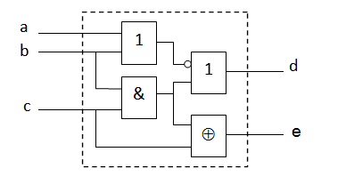
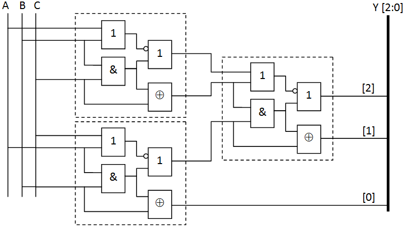

# Lab 01

## Exercise 1.

Consider the combinatorial circuit shown in figure below. Describe it in Verilog.



**Solution**. We will create a new file my_circuit.v with the following content:

```
module my_circuit(input a, b, c,
                 output d, e);

  assign d = ~(a | b) | (b & c);
  assign e = (b & c) ^ c;

endmodule
```

## Exercise 2.

Create the TestBench for the simulation of the combinatorial circuit from Exercise 1; and perform the simulation.

**Solution**. We will create a new file, e.g. my_circuit_tb.v, which defines inputs to the circuit (stimulus list). Then we are able to simulate the circuit and observe its outputs.

```
module test();
  reg a, b, c;
  wire x, y;

  my_circuit my_circuit_XY(a, b, c, x, y);

  initial begin
    $dumpfile("test.vcd");
    $dumpvars;
    a=0;
    b=0;
    c=0;
    #160 $finish;
  end

  always #20 a = ~a;
  always #40 b = ~b;
  always #80 c = ~c;

  always @(x) $display( "The value of x was changed. Time=%d, x=%b. Inputs: a=%b, b=%b, c=%b.",$time, x,a,b,c);

endmodule
```

In the command line we will compile both the files, run the simulation, and visualize the results by following commands:

```sh
iverilog my_circuit.v my_circuit_tb.v
./a.out
gtkwave test.vcd
```

Alternatively, we can use vvp instead of gtkwave:

```sh
iverilog -otest.vvp my_circuit.v my_circuit_tb.v
vvp test.vvp
```

## Exercise 3.

Sketch (by the hand) a schematic of the circuit according the following description:

```
  if A is equal to 1,
  then Y is equal to (B and C)
  else Y is equal to (B xor D) or C
The variables A, B, C and D are logical variables.
```

## Exercise 4.

Describe the logic circuit from Exercise 3 in Verilog and perform the simulation. What is the value of Y in the case when A==0, B==1, C==0, D==0? Support your statement by the simulation results.

## Exercise 5.

Describe in Verilog following circuit. Keep in mind that it is composed from three identical circuits according the Exercise 1. Use structural description. What is the output when A==0, B==1 and C==1?

