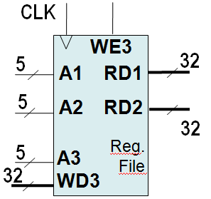

# 2. Seminar - Basic components
## Exercise 1.
Describe in Verilog following components. (It is highly recomended to test each individual component and do not suppose it works as expected.)

- 2:1 multiplexer having 32-bit data ports (inputs: d0, d1, select; output: y)
- 3:1 multiplexer having 32-bit data ports (inputs: d0, d1, d2, select; output: y)
- 32-bit adder
- 32 bit wide unit for multiplication by constant of 4 (one input, one output)
- 32-bit comparator (two inputs, one output)
- 16 to 32-bit sign extension unit – extends 16-bit input (two's complement number) to 32-bit
- 32-bit register (inputs: datain, clk; output: dataout) – transfers datain to dataout on rising edge of clk, otherwise dataout remains unchanged
- Resetable 32 bit register

## Exercise 2.

Describe in Verilog a three-port 32-bit register file containing 32 registers (inputs: A1, A2, A3, WD3, WE3, clk; outputs: RD1, RD2). Register file has two read ports and one write port. The read ports take 5-bit address inputs, A1 and A2, each specifying one of $2^5=32$ registers as source operands. They read the 32-bit register values onto read data outputs RD1 and RD2, respectively. The write port takes a 5-bit address input, A3; a 32-bit write data input, WD3; a write enable input, WE3; and a clock. If the write enable is 1, the register file writes the data into the specified register on the rising edge of the clock. Moreover, the register #0 is hardwired to 0.

## Exercise 3.

Describe in Verilog a 32-bit ALU (inputs: SrcA, SrcB, ALUControl; outputs: Zero, ALUResult) – The ALU performs following functions depending on ALUControl:

- add when ALUcontrol = 010; it means that: ALUResult = SrcA + SrcB
- sub when ALUcontrol =110; it means that: ALUResult = SrcA – SrcB
- and when ALUcontrol = 000; it means that: ALUResult = SrcA & SrcB
- or when ALUcontrol = 001; it means that: ALUResult = SrcA | SrcB
- xor when ALUcontrol = 011; it means that: ALUResult = SrcA ^ SrcB
- slt (set less than) when ALUcontrol = 111; it means that: ALUResult = SrcA < SrcB

The flag Zero is asserted when ALUResult is zero. SrcA, SrcB, ALUResult: 32 bit; ALUControl: 3bit; Zero: 1bit

[typicke_chyby_verilog.pdf](typicke_chyby_verilog.pdf)